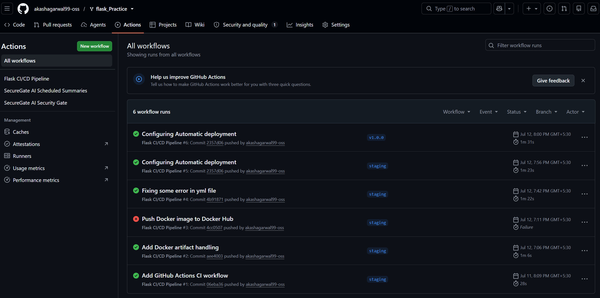
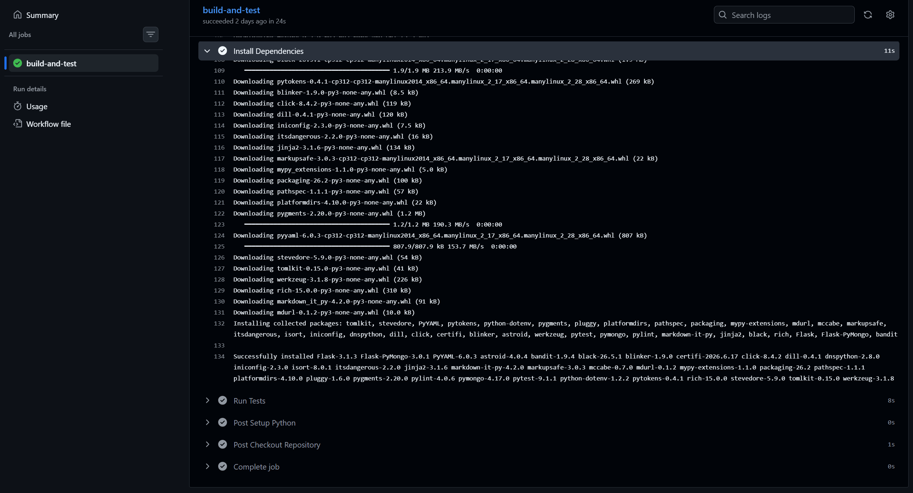
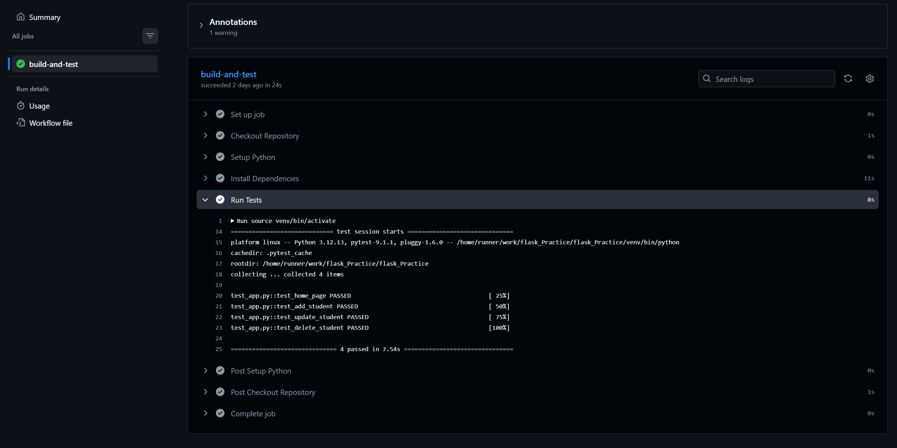
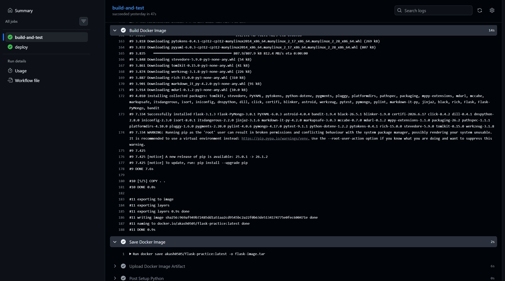
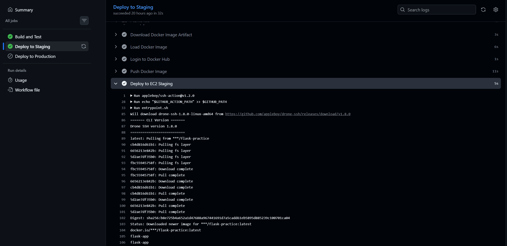
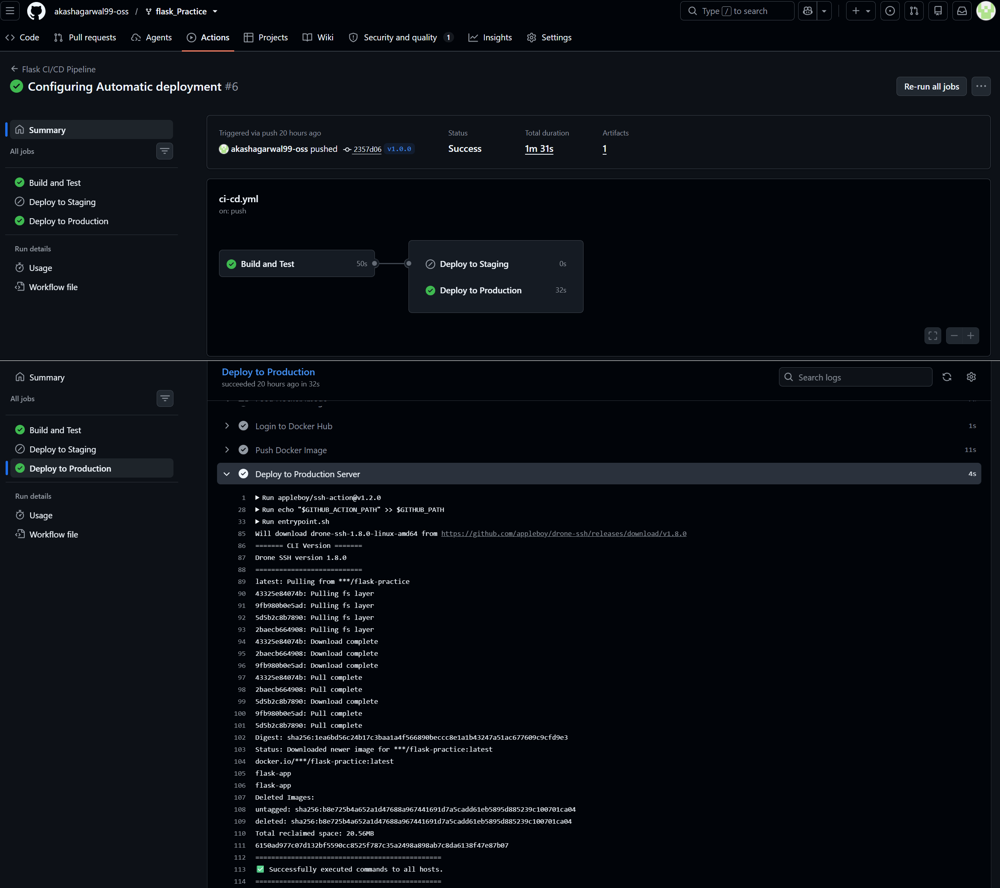
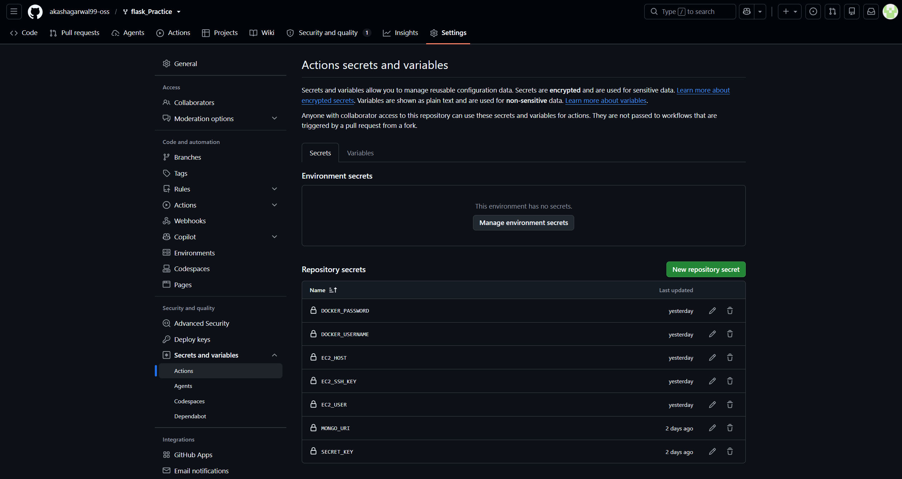

# GitHub Actions CI/CD Pipeline for Flask Application

## Overview

This project implements a GitHub Actions workflow that builds, tests, containerizes, and deploys a Python Flask application. Tests run on every push, a Docker image is built and pushed to Docker Hub, and the application is deployed to an AWS EC2 staging instance.

Repository: https://github.com/akashagarwal99-oss/flask_Practice.git

## Technology Stack

  - GitHub Actions
  - Docker
  - Docker Hub
  - Python 3.12
  - Flask
  - Pytest
  - AWS EC2

## Architecture

    Push
      |
    GitHub Actions
      |
    Checkout Repository
      |
    Setup Python
      |
    Install Dependencies
      |
    Run Unit Tests
      |
    Build Docker Image
      |
    Upload Docker Artifact
      |
    Deploy to Staging
      |    |
      |    Download Artifact
      |    |
      |    Push Image to Docker Hub
      |    |
      |    SSH to EC2
      |    |
      |    Docker Pull
      |    |
      |    Restart Container

## CI/CD Workflow

    Push to staging
          |
          v
    GitHub Actions
          |
    Checkout Repository
          |
    Install Dependencies
          |
    Run Unit Tests
          |
    Build Docker Image
          |
    Push Image to Docker Hub
          |
    Deploy to AWS EC2
          |
    Flask Application Updated

## Prerequisites

  - GitHub repository with a main branch and a staging branch
  - Python 3 application with a requirements.txt file
  - Unit tests written using pytest
  - Docker Hub account for storing built images
  - AWS EC2 instance running Docker, reachable via SSH
  - GitHub Secrets configured for Docker Hub and EC2 access

## Workflow File

Location: .github/workflows/ci-cd.yml

Jobs defined in the workflow:

Install Dependencies
  Checks out the repository, sets up Python, and installs packages listed in requirements.txt.

Run Tests
  Executes the test suite with pytest. The pipeline stops here if any test fails.

Build
  Runs only after tests pass. Builds a Docker image of the Flask application and uploads it as a workflow artifact.

Deploy to Staging
  Runs only on pushes to the staging branch. Downloads the built image artifact, pushes it to Docker Hub, connects to the EC2 instance over SSH, pulls the new image, and restarts the container.

Deploy to Production
  Runs only when a release is tagged. Follows the same build and push process, deploying to the production EC2 instance using separate production secrets.

## GitHub Secrets Configuration

Secrets are added under Repository Settings > Secrets and variables > Actions.

  - MONGO_URI: database connection string used by the application
  - SECRET_KEY: Flask application secret key
  - DOCKER_USERNAME: Docker Hub account username
  - DOCKER_PASSWORD: Docker Hub account password or access token
  - EC2_HOST: public address of the EC2 instance
  - EC2_USER: SSH user for the EC2 instance
  - EC2_SSH_KEY: private SSH key used to connect to the EC2 instance

Secrets are referenced in the workflow YAML using the secrets context and are never printed in logs or committed to the repository.

## Triggers

  - push to the staging branch runs the full pipeline and deploys to staging on EC2
  - push to the main branch runs install, test, and build only
  - publishing a release (tag) runs the full pipeline and deploys to production

## Screenshots

Screenshot 1: GitHub Actions Workflow
  List of workflow runs in the Actions tab.

Screenshot 2: Install Dependencies Step
  Log output showing checkout, Python setup, and pip install completing successfully.

Screenshot 3: Run Tests Step
  Log output showing pytest results.

Screenshot 4: Build Docker Image
  Log output showing the Docker image being built and uploaded as an artifact.

Screenshot 5: Deploy to Staging
  Log output showing the image pushed to Docker Hub and deployed to the EC2 staging instance.

Screenshot 6: Deploy to Production
  Log output showing successful deployment to the production EC2 instance on a tagged release.

Screenshot 7: GitHub Secrets Configuration
  Repository secrets configured under Settings.

## Submission

  - Repository: https://github.com/akashagarwal99-oss/flask_Practice
  - Workflow file: .github/workflows/ci-cd.yml
  - Screenshots: screenshots/ subdirectory
