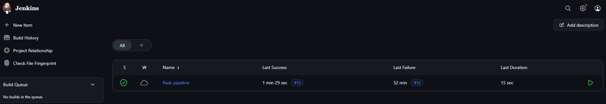
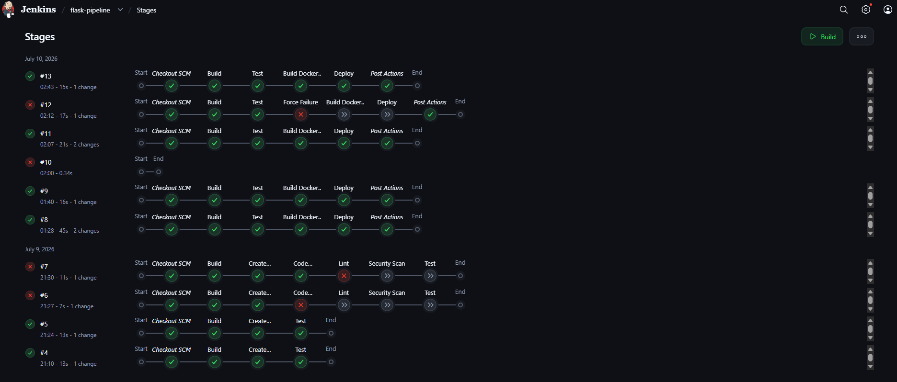
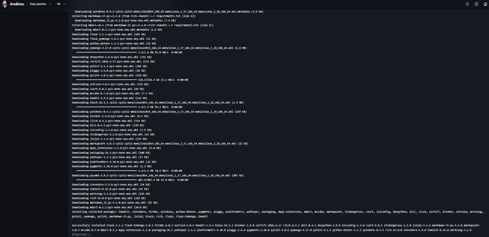
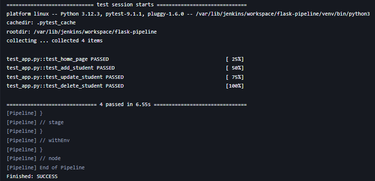
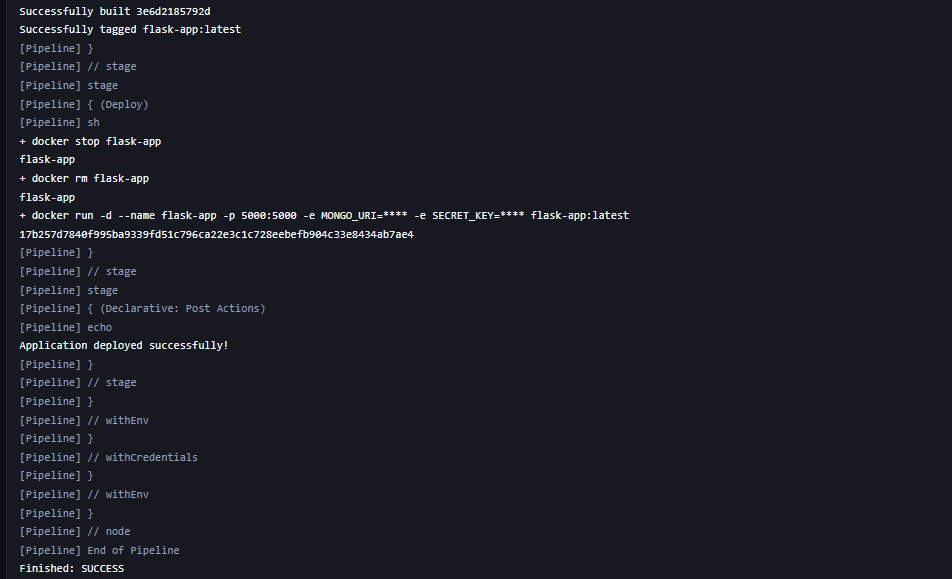
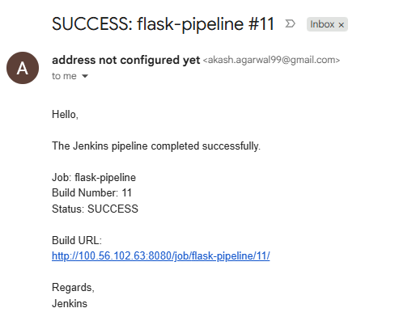
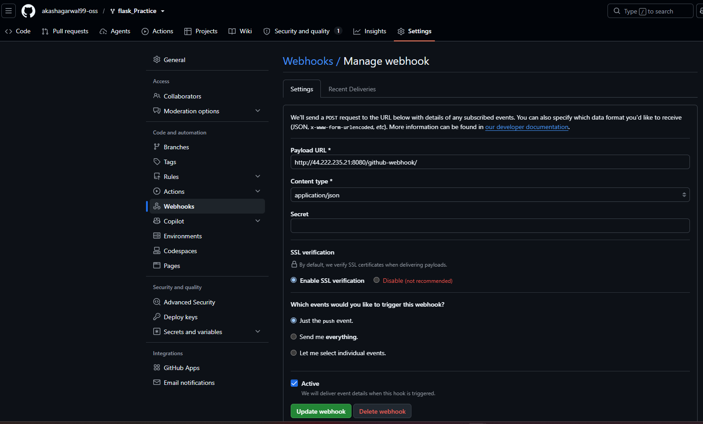
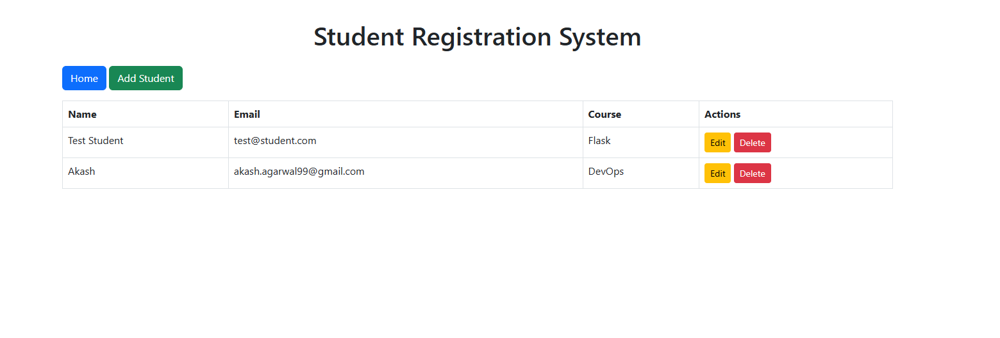

# Jenkins CI/CD Pipeline for Flask Application

## Overview

This project sets up a Jenkins pipeline that automatically builds, tests, and deploys a Python Flask application to staging whenever changes are pushed to the main branch. Email notifications are sent on build success or failure.

Source application: https://github.com/mohanDevOps-arch/flask_Practice.git (forked)

## Architecture

    Developer -> git push (main) -> GitHub Repo -> Webhook
        -> Jenkins Pipeline (Build -> Test -> Deploy) -> Staging Environment
        -> Email Notification (Success / Failure)

## Prerequisites

  - Jenkins installed on a VM or cloud host, with Git, Pipeline, and Email Extension plugins
  - Python 3 and pip available on the Jenkins server
  - Forked copy of the flask_Practice repository
  - SMTP credentials configured in Jenkins for email alerts
  - A staging host or directory to deploy the app to

## Pipeline Stages (Jenkinsfile)

Build
  Installs dependencies from requirements.txt using pip.

Test
  Runs unit tests with pytest. A failure here stops the pipeline before deployment.

Deploy
  Runs only if tests pass. Copies the app to staging and restarts it.

Notify
  Sends an email on every build, indicating success or which stage failed.

## Trigger

A GitHub webhook pointing to the Jenkins server triggers a new build on every push to main. Poll SCM can be used as a fallback if a public webhook endpoint is unavailable.

## Screenshots

Screenshot 1: Jenkins Dashboard
  Pipeline job listed on the Jenkins dashboard.

Screenshot 2: Pipeline Stage View
  Build, Test, and Deploy stages shown as successful.

Screenshot 3: Build Stage Console Output
  Console log showing pip install of dependencies.

Screenshot 4: Test Stage Console Output
  Console log showing pytest results.

Screenshot 5: Deploy Stage Console Output
  Console log showing successful deployment to staging.

Screenshot 6: Email Notification
  Email received after a build, showing success or failure status.

Screenshot 7: GitHub Webhook Configuration
  Webhook settings in the GitHub repository pointing to Jenkins.

Screenshot 8: Staging Application Running
  Flask app live in the staging environment after deployment.

## Submission

  - Forked repository: https://github.com/akashagarwal99-oss/flask_Practice
  - Jenkinsfile: repository root
  - Screenshots: screenshots/ subdirectory
